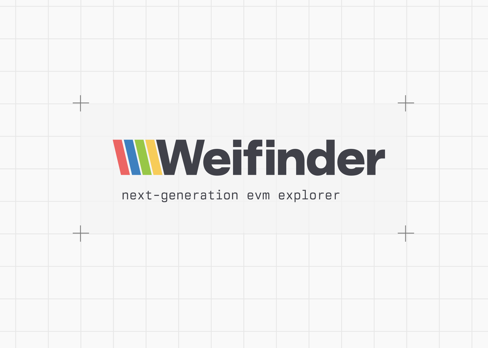

# Weifinder Indexer



A blockchain indexer written in Rust that fetches and stores block data from EVM-compatible chains.

## Overview

Weifinder Indexer connects to an Ethereum-compatible blockchain via WebSocket RPC, fetches blocks in real-time, and stores them in a DuckLake database.

## Features

- Real-time block indexing via WebSocket subscriptions
- Concurrent block fetching with configurable rate limiting
- Checkpoint-based resumption for fault tolerance
- Reorg detection
- DuckDB/DuckLake for efficient block data storage

## Architecture

The indexer consists of several components:

- **ChainIndexer**: Main orchestrator that coordinates block fetching, processing, and storage
- **BlockFetcher**: Concurrent block fetcher with rate limiting and backpressure control
- **ChainHeadWatcher**: Subscribes to new block headers to track chain tip
- **IndexerProvider**: Wrapper around the RPC provider with head tracking

## Requirements

- Rust 2024 edition
- DuckDB with DuckLake extension (for block data)
- Access to an EVM-compatible WebSocket RPC endpoint

## Configuration

The indexer is configured via the `Settings` struct:

| Setting | Description |
|---------|-------------|
| `rpc_url` | WebSocket RPC endpoint URL |
| `fetcher_max_concurrency` | Maximum concurrent block fetch requests |
| `fetcher_max_blocks_per_second` | Maximum blocks to fetch per second (a single block may contain multiple RPC requests. e.g, `eth_getBlockByNumber` and `eth_getBlockReceipts`) |

## Usage

```bash
cargo run
```

By default, the indexer connects to `wss://testnet.riselabs.xyz/ws`.

## Database Schema

### Blocks (DuckDB)

Stores block data per chain:

```sql
CREATE TABLE blocks_{chain_id} (
  number UINT64 NOT NULL,
  hash VARCHAR NOT NULL,
  timestamp UINT64 NOT NULL,
  parent_hash VARCHAR NOT NULL,
  gas_used UINT64 NOT NULL,
  gas_limit UINT64 NOT NULL
);
```

## Dependencies

- **alloy**: Ethereum library for RPC and types
- **duckdb**: Analytical database for block storage
- **tokio**: Async runtime
- **flume**: MPMC channels for block data flow
- **governor**: Rate limiting
- **tracing**: Logging and diagnostics

## Development Status

This project is in early development. Notable TODOs:

- Implement reorg handling at data store level
- Add configuration file/environment variable support
- Implement release build data connection setup
